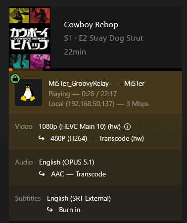

# MiSTer_GroovyRelay



A cast-target bridge for the MiSTer. Run it alongside your Plex/Jellyfin Media Server; it advertises itself as a cast target on the LAN, and when you pick it from the client's "Cast" menu it transcodes the output through FFmpeg and streams raw RGB fields + PCM audio over the [Groovy_MiSTer](https://github.com/psakhis/Groovy_MiSTer) UDP protocol into a MiSTer FPGA. The MiSTer drives a 15 kHz analog CRT directly, giving you genuine NTSC/PAL video.

Note: The primary deployment target is a Docker container running on the same host as your media server, but Win/Mac/Linux binaries are provided as well. Running on a different host adds networking overhead and is slightly less stable (but I'm working on it). 

## Cast Sources
- Plex
- Jellyfin
- Plex/Jellyfin music tracks with CRT visualizer output
- YouTube/Vimeo/etc. URL (and other sites supported by yt-dlp)
- URL to video file (Archive.org .mkv, .mp4, etc.)
- URL to M3U/M3U8 playlist ([ws4channels](https://github.com/rice9797/ws4channels), etc.)
- Torrent streaming (uploaded .torrent files and magnet links)
- DLNA / UPnP MediaRenderer
- Built-in catalog of streaming "channels" (Cartoon Rewind, MTV Rewind, Toonami Aftermath; bundled-only, not user IPTV import)

## Hardware requirements

- MiSTer FPGA with Analogue I/O board or direct video adapter wired to a 15 kHz-capable CRT (consumer, PVM, arcade, etc.)
- Groovy_MiSTer installed on your MiSTer, ideally the [44.1khz audio fix release](https://github.com/iequalshane/Groovy_MiSTer/releases/tag/0.8)
- A host on the same LAN running Docker (Linux, Unraid, Synology, a Raspberry Pi 4/5), anything with a few spare CPU cycles and gigabit-class networking.
- A Plex/Jellyfin Media Server reachable from that host (optional)

The bridge itself is stateless and light, just a few hundred MB of RAM and one FFmpeg worker per active cast. Video transcode is primarily handled by the media server, FFmpeg in this container takes 480p from the server to 480i.

## Quick start (Docker)

Docker with host networking is the primary deployment path.

```bash
# 1. Generate config.toml, then edit bridge.mister.host.
mkdir -p /opt/mister-groovy-relay
docker run --rm --network=host \
  -v /opt/mister-groovy-relay:/config \
  idiosync000/mister-groovy-relay:latest
$EDITOR /opt/mister-groovy-relay/config.toml

# 2. Run the bridge.
docker run -d --name mister-groovy-relay --restart unless-stopped \
  --network=host \
  -v /opt/mister-groovy-relay:/config \
  idiosync000/mister-groovy-relay:latest
```

Open `http://<host>:32500/`, choose Plex or Jellyfin in the sidebar, and link your server. The token is saved in `data.json` under `data_dir`.

For headless Plex linking:

```bash
docker run --rm -it --network=host \
  -v /opt/mister-groovy-relay:/config \
  idiosync000/mister-groovy-relay:latest --link
```

Host networking is the supported Docker path because it gives the bridge the host's LAN address, avoids Docker NAT on the MiSTer UDP source port, and lets Plex GDM multicast work normally. Simple bridge-mode port publishing is not equivalent: `-p 32500:32500/tcp -p 32101:32101/udp -p 32412:32412/udp` can expose unicast ports, but Docker still NATs outbound UDP and does not make LAN multicast membership reliable.

Advanced L2 container networks can work. With macvlan/ipvlan on `br0` or another LAN-facing parent interface, give the container its own LAN IP, set `bridge.host_ip` to that IP, and make sure the MiSTer, Plex Media Server, and Plex controllers can reach it. In that layout you do not publish ports; the container owns `32500/tcp`, the configured `bridge.mister.source_port` (default `32101/udp`), and Plex GDM multicast (`239.0.0.250`, UDP `32412/32413`) directly.

## Native builds

Native archives are built for Windows, macOS, and Linux. On first run, the bridge writes a platform-specific config file and exits so you can set `bridge.mister.host`, then relaunch it.

| OS | Default config path |
| --- | --- |
| Windows | `%APPDATA%\mister-groovy-relay\config.toml` |
| macOS | `~/Library/Application Support/mister-groovy-relay/config.toml` |
| Linux | `$XDG_CONFIG_HOME/mister-groovy-relay/config.toml` or `~/.config/mister-groovy-relay/config.toml` |

Release archives bundle `ffmpeg`, `ffprobe`, and `yt-dlp` beside the bridge binary. To use system-installed tools instead, set `bridge.ffmpeg_path`, `bridge.ffprobe_path`, or `bridge.ytdlp_path` in `config.toml`.

On macOS, right-click the binary and choose **Open** the first time if Gatekeeper blocks it. As a fallback:

```bash
xattr -dr com.apple.quarantine /path/to/mister-groovy-relay-folder
```

## First-time setup

1. Install the Docker image or native binary.
2. Start once to generate `config.toml`.
3. Set `bridge.mister.host` to your MiSTer's LAN IP.
4. Restart the bridge.
5. Open `http://<host-ip>:32500/` and link Plex or Jellyfin.
6. Cast from Plex, Jellyfin, a URL, a supported streaming catalog, DLNA, or a torrent source.

The settings UI labels whether a saved field applies live, restarts the current cast, or requires a bridge restart.

## Adapters

| Adapter | Starts from | Default | Notes |
| --- | --- | --- | --- |
| Plex | Plex cast picker | On after linking | Needs multicast discovery and a stable bridge address. |
| Jellyfin | Jellyfin cast picker | On after linking | Link through the settings UI. |
| URL | URL panel or browser extension | On | Supports direct media and `yt-dlp` pages. See [docs/url-adapter.md](docs/url-adapter.md) and [`extension/firefox/`](extension/firefox/README.md). |
| Streams | Bundled catalog entries | On | Includes Cartoon Rewind, MTV Rewind, and Toonami Aftermath bundled channels; not a user IPTV importer. |
| Torrent | Magnet link or `.torrent` upload | Off | Requires explicit traffic acknowledgement. See [docs/torrent.md](docs/torrent.md). |
| DLNA / UPnP | DLNA controller | Off | Exposes unauthenticated LAN control. See [docs/dlna.md](docs/dlna.md). |

## Settings UI

Open `http://<host>:32500/` after the bridge starts. The UI lets you:

- Link Plex and Jellyfin accounts.
- Enable or disable adapters.
- Flip `interlace_field_order` live while watching the CRT.
- See adapter state at a glance: running, stopped, or erroring.
- Save bridge settings with clear apply scope.

## Operations

Most installs only need the quick start. Use [docs/operations.md](docs/operations.md) for the longer notes:

| Topic | When it matters |
| --- | --- |
| Multi-NIC hosts | Cast target appears, but commands never reach the bridge. |
| Docker CPU contention | Playback shows motion glitches under host load. |
| Fake MiSTer diagnostics | You need to prove the bridge is sending packets before debugging the real MiSTer path. |

DLNA controller findings live in [docs/dlna-compatibility.md](docs/dlna-compatibility.md).

## Troubleshooting

| Symptom | First check | More detail |
| --- | --- | --- |
| Target missing from Plex | `--network=host`, multicast, server link, bridge logs | [Operations](docs/operations.md) |
| Cast target duplicates another Plex target | Run the bridge from a different IP than the Plex server | [Operations](docs/operations.md) |
| No video on CRT | MiSTer is running Groovy_MiSTer and listening on `mister_port` | [Operations](docs/operations.md) |
| Audio drift or motion glitches | Host CPU contention | [Operations](docs/operations.md) |
| Field shimmer | Flip `interlace_field_order` | Settings UI |
| Plex reports target offline after cast | Fixed `source_port` and no port conflict | [Operations](docs/operations.md) |
| DLNA renderer missing or uncontrollable | `bridge.host_ip`, UDP 1900, trusted LAN only | [DLNA adapter](docs/dlna.md) |

## License

[GPL-3.0](https://www.gnu.org/licenses/gpl-3.0.en.html). See the design notes for why: this project stands on the shoulders of several GPL-3 references (plexdlnaplayer, plex-mpv-shim, Groovy_MiSTer) and carries that license forward.
