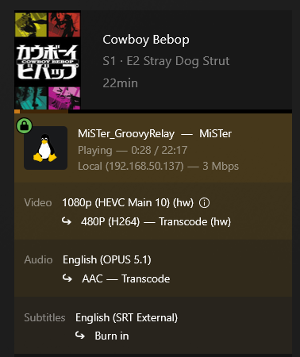

# MiSTer_GroovyRelay



A headless cast-target bridge that turns a MiSTer FPGA into a cast receiver. It advertises itself on the LAN; when you pick it from a Plex or Jellyfin "Cast" menu, it converts the stream with FFmpeg and sends RGB fields and PCM audio over the [Groovy_MiSTer](https://github.com/psakhis/Groovy_MiSTer) UDP protocol. The MiSTer drives a 15 kHz analog CRT directly, giving you genuine NTSC/PAL video.

It also casts yt-dlp-compatible URLs, torrents and magnet links, DLNA, and local files from the web UI.

The primary target is a Docker container on the same host as your media server; Windows, macOS, and Linux binaries are also provided.

<p align="center">
  
</p>

<p align="center">
  
</p>

## Cast sources

- Plex and Jellyfin, including music tracks with a CRT visualizer
- YouTube, Twitch, Vimeo, and other yt-dlp sites
- Direct video URLs (Archive.org `.mkv`, `.mp4`, etc.) and M3U/M3U8 playlists, with buffering for live HLS
- Torrents (`.torrent` files, URLs, and magnet links)
- Local media files
- DLNA / UPnP MediaRenderer
- Spotify Connect and AirPlay (music to the CRT visualizer)
- A built-in catalog of streaming channels

## Requirements

- MiSTer FPGA with an Analogue I/O board or direct video adapter, wired to a 15 kHz-capable CRT
- Groovy_MiSTer on the MiSTer, ideally the [44.1 kHz audio fix release](https://github.com/iequalshane/Groovy_MiSTer/releases/tag/0.8)
- A host on the same LAN running Docker (Linux, Unraid, Synology, Raspberry Pi 4/5) with gigabit networking
- Optional: a Plex or Jellyfin Media Server reachable from that host

The bridge is light: a few hundred MB of RAM and one FFmpeg worker per cast.

## Quick start (Docker)

```bash
# 1. Generate config.toml, then set bridge.mister.host to your MiSTer's IP.
mkdir -p /opt/mister-groovy-relay
docker run --rm --network=host \
  -v /opt/mister-groovy-relay:/config \
  idiosync000/mister-groovy-relay:latest
$EDITOR /opt/mister-groovy-relay/config.toml

# 2. Run the bridge.
docker run -d --name mister-groovy-relay --restart unless-stopped \
  --network=host \
  -v /opt/mister-groovy-relay:/config \
  idiosync000/mister-groovy-relay:latest
```

Open `http://<host>:32500/`, link Plex or Jellyfin from the sidebar, and cast. The settings UI marks whether each setting applies live, restarts the current cast, or needs a bridge restart.

Host networking is required for Plex discovery. For macvlan/ipvlan networking, headless Plex linking, native Windows/macOS/Linux builds, and mounting media for Local Files, see [docs/install.md](docs/install.md). Don't pin the container to Unraid's isolated cores; see [Troubleshooting](#troubleshooting).

## Adapters

| Adapter | Starts from | Default | Notes |
| --- | --- | --- | --- |
| Plex | Plex cast picker | On after linking | Needs multicast discovery and a stable bridge address. |
| Jellyfin | Jellyfin cast picker | On after linking | Link through the settings UI. |
| URL | Cast drawer or browser extension | On | Direct media and `yt-dlp` pages. See [docs/url-adapter.md](docs/url-adapter.md) and the [Firefox extension](extension/firefox/README.md). |
| Streams | Bundled catalog | On | Toonami Aftermath and other channels. |
| Local Files | Settings drawer | Off | Cast from named on-disk libraries. See [docs/install.md](docs/install.md#local-files). |
| Torrent | Cast drawer | Off | Requires explicit traffic acknowledgement. See [docs/torrent.md](docs/torrent.md). |
| DLNA / UPnP | DLNA controller | Off | Unauthenticated LAN control. See [docs/dlna.md](docs/dlna.md). |
| Spotify Connect | Spotify device picker | Off | Premium required. See [docs/music.md](docs/music.md#spotify-connect). |
| AirPlay | AirPlay speaker picker | Off | AirPlay 1; not on Windows. See [docs/music.md](docs/music.md#airplay). |
| AUX | Receiver page | Off | Visualizer from line-in or a remote FFmpeg producer. See [docs/music.md](docs/music.md#aux-analog-visualizer). |

## CRT setup

- **Field order:** if the picture shimmers, flip `interlace_field_order` in Settings; it applies live.
- **Picture size and position:** press **Calibrate on CRT** in Settings → Video & Audio and adjust until the test pattern's border shows on all four edges.
- **On-screen display:** volume, channel, and transport overlays are on by default, with an optional clock.

Details: [docs/picture.md](docs/picture.md). For the GroovyNLC core and the frame codec setting, see [docs/groovynlc.md](docs/groovynlc.md).

## Troubleshooting

| Symptom | First check | More detail |
| --- | --- | --- |
| Target missing from Plex | `--network=host`, multicast, server link, bridge logs | [Operations](docs/operations.md#general-troubleshooting) |
| Cast target duplicates another Plex target | Run the bridge from a different IP than the Plex server | [Operations](docs/operations.md#general-troubleshooting) |
| No video on CRT | MiSTer is running Groovy_MiSTer and listening on `mister_port` | [Operations](docs/operations.md#general-troubleshooting) |
| Lower part of the picture tears or flashes | Container pinned only to isolated cores (Unraid `isolcpus`) or to one core; the bridge warns in Settings → System. Remove the pinning or pin to non-isolated cores | [Operations](docs/operations.md#cpu-pinning-and-isolated-cores-unraid) |
| Occasional single-frame hitch on a busy host | Other containers crowd out the bridge. Add `--cpu-shares=8192` (Unraid: **Extra Parameters**) so it wins CPU under contention | [Operations](docs/operations.md#cpu-contention-under-docker) |
| Audio drift or constant motion glitches | Host CPU contention | [Operations](docs/operations.md#cpu-contention-under-docker) |
| Field shimmer | Flip `interlace_field_order` | Settings UI |
| Picture edges cut off, or picture off-centre | Calibrate on CRT | [Picture setup](docs/picture.md) |
| Plex reports target offline after cast | Fixed `source_port` and no port conflict | [Operations](docs/operations.md#general-troubleshooting) |
| DLNA renderer missing or uncontrollable | `bridge.host_ip`, UDP 1900, trusted LAN only | [DLNA adapter](docs/dlna.md) |

More in [docs/operations.md](docs/operations.md): multi-NIC hosts, live HLS buffering, delta-LZ4, and scripting the UI.

## License

[GPL-3.0](https://www.gnu.org/licenses/gpl-3.0.en.html). This project builds on GPL references (plexdlnaplayer and plex-mpv-shim under GPL-3, and the GPL-2 Groovy_MiSTer protocol) and carries that license forward.
